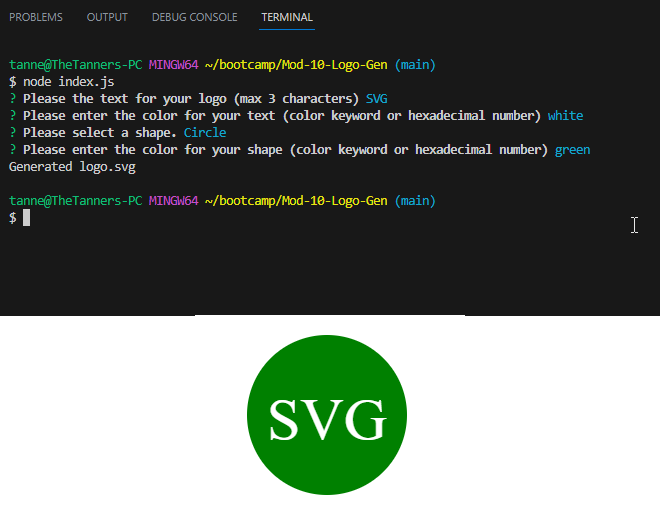

# Mod-10-Logo-Gen

## Description

A node.js application that generates a logo.svg file. It is designed to help developers easily generate a logo. It creates an automated way to generate simple logo in SVG. 

## Installation

Project has a dependency on the inquirer and Jest libraries and the user must run npm install to include the needed libraries.  Additionally, node.js must be installed.

## Usage

Run node index.js from the installed folder. 

Sample usage video link: [Here](https://youtu.be/IWXJrDBbNK0)

The following image shows the application's appearance and functionality:

## Credits

N/A

## License

N/A
